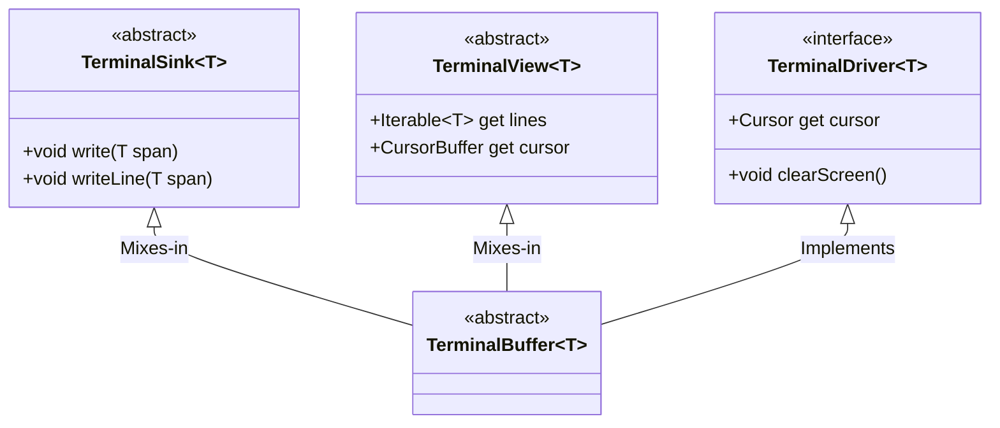
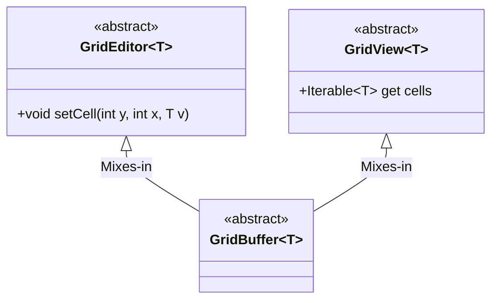

# Dart Terminal

A _fun_ and _minimalist_ experiment in crafting terminal UIs with Dart.

[](https://github.com/matanlurey/dt/actions/workflows/linux.yaml)
[](https://github.com/matanlurey/dt/actions/workflows/macos.yaml)
[](https://coveralls.io/github/matanlurey/dt?branch=main)

Inspiration:

- <https://github.com/crossterm-rs/crossterm>
- <https://github.com/muesli/termenv>
- <https://github.com/wez/wezterm/tree/main/termwiz>
- <https://sr.ht/~rockorager/vaxis/>
- <https://github.com/timsneath/dart_console>

Work-in-progress:

- [x] Canonical terminal with input support (`TerminalBuffer`).
- [x] Remove `Cursor`, add `CursorBuffer` to `TerminalBuffer`.
- [x] Remove elements of `InteractiveCursor` that read the cursor position.
- [x] Add cursor positioning to `AnsiHandler`.
- [ ] Implement `AnsiTerminal`, a driver using ANSI terminal output.
- [ ] Formatting and styling (`Styled`).

## Overview

> [!NOTE]
> This project is a work-in-progress and everything is subject to change.

This project aims to provide an intuitive and ergonomic API for building,
emulating, and interacting with terminal applications in Dart. It's designed to
be a low-level building block for more complex terminal applications, such as
text editors, games, and interactive command-line interfaces.

### TerminalBuffer

A `TerminalBuffer` represents a sequence of lines of text or text-like spans
that can be written to and read from, and a cursor that can be moved around.

Intended to represent an emulation of terminal output, writing to a terminal replaces all spans after the cursor and moves the cursor accordingly, while clearing the screen either removes content or replaces it with empty spans.

```dart
import 'package:dt/dt.dart';

void main() {
  final terminal = TerminalBuffer(
    const StringSpan(), 
    lines: ['Hello, World!'],
  );

  // World isn't that impressive, let's replace it with Dart!
  terminal.cursor.column -= 6;
  terminal.write('Dart!');

  print(terminal.toDebugString(
    drawBorder: true,
    drawCursor: true,
    includeLineNumbers: true,
  ));
}
```

```shell
% dart example/terminal.dart
┌─┬─────────────┐
│1│Hello, Dart!█│
└─┴─────────────┘
```

The major API surface of a `TerminalBuffer` includes:



### GridBuffer

A `GridBuffer` is a 2-dimensional buffer of _cells_.

Intended to represent individual pixels, ASCII characters, or code units.

```dart
import 'package:dt/dt.dart';

void main() {
  final grid = GridBuffer.filled(3, 3, ' ');

  // An in-progress game of tic-tac-toe.
  grid.setCell(1, 1, 'X');
  grid.setCell(0, 0, 'O');
  grid.setCell(2, 2, 'X');

  print(grid.toDebugString(drawGrid: true));
}
```

```shell
% dart example/grid.dart
┌───┬───┬───┐
│ O │   │   │
├───┼───┼───┤
│   │ X │   │
├───┼───┼───┤
│   │   │ X │
└───┴───┴───┘
```

The major API surface of a `GridBuffer` includes:



### AnsiTerminal

An `AnsiTerminal` is a sink and controller for ANSI terminal output.

So far, the types have been focused on emulating terminal output, but an
`AnsiTerminal` is intended to be a sink for writing ANSI terminal codes _to_ an
external terminal.

```dart
import 'package:dt/dt.dart';

void main() {
  final terminal = AnsiTerminal.fromStdout();

  terminal.write('Hello, World!');
  terminal.cursor.moveUp(1);
  terminal.write('Hello, Dart!');
}
```

```shell
% dart example/ansi.dart
Hello, Dart!
```

## Benchmarks

While not the primary goal of this project, it's interesting to see how the
`libc`-based implementation compares to the `dart:io`-based one. The following
benchmarks were run on an M2 Max MacBook Pro (2021) with 10 CPU cores on Dart
version 3.4.0:

```shell
# Redirect stderr to /dev/null to avoid printing junk to the terminal.
dart run benchmark/stdout_write.dart 2> /dev/null
```

| Implementation | Time (ms)       |
| -------------- | --------------- |
| `dart:io`      |  1203.0025 us   |
| `libc`         |  752.19175 us   |

📈 The `libc`-based implementation is about **37% faster** than `dart:io`.

> [!TIP]
> In my tests, an AOT-compiled binary had no noticeable performance impact.

## Contributing

### CI

This package is:

- Formatted with `dart format`.
- Checked with `dart analyze`.
- Tested with `dart test`, including with code coverage.

See [`github/workflows/check.yaml`](./.github/workflows/check.yaml) for details.

### Coverage

To view the coverage report locally (MacOS):

```shell
brew install lcov
dart run coverage:test_with_coverage
genhtml coverage/lcov.info -o coverage/html
open coverage/html/index.html
```
